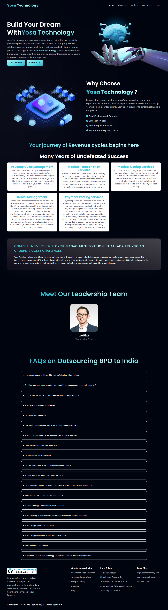

# Welcome to Yosa Technology! 🚀

🎉 Welcome to the exciting world of Yosa Technology, where React, Vite, and Tailwind CSS come together to create magic! 💻

## What's Yosa Technology All About?

Yosa Technology isn't just a website – it's a digital masterpiece crafted with React, powered by Vite, and styled with Tailwind CSS! 💡 Dive into a world of innovation where every line of code breathes life into stunning interfaces and dynamic features.

## What Sets Yosa Tech Apart?

What makes Yosa Technology stand out? It's the perfect synergy of modern technologies! 🌟 Explore seamless navigation with react-router-dom, lightning-fast performance with Vite, and sleek designs with Tailwind CSS – all packed into one exhilarating project!

## Ready to Experience Yosa Tech?

Excited to see what Yosa Technology has to offer? Head over to [yosatechnology.com](https://yosatechnology.com/) and witness the power of React, Vite, and Tailwind CSS in action! Don't forget to drop a message and share your feedback – your input drives our innovation! 💌

## Let's Stay Connected!

Got questions or simply want to chat about tech? Shoot me an email at [ankitmalik844903@gmail.com](mailto:ankitmalik844903@gmail.com). Let's geek out together! 📧

And hey, let's connect on LinkedIn too! Here's my [LinkedIn Profile](https://www.linkedin.com/in/ankitmalik00/). Let's stay connected and explore the endless possibilities of tech! 🔗
